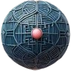
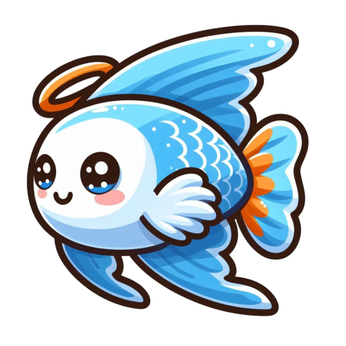
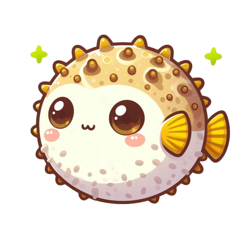
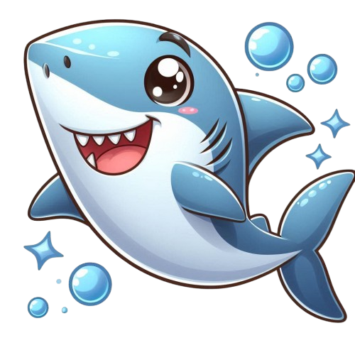

    

# 🐠 轉珠水族箱 · Tile-Matching Aquarium

**結合「轉珠消除」與「水族箱模擬」的純前端網頁遊戲。** 
拖曳珠子三消得分，每次消除掉落飼料，餵養在水族箱裡悠游的魚群。 
邊玩邊養魚，越消越療癒！

 

  

 

🎮 **遊戲網址** → <a href="https://pp771007.github.io/tile-matching-game/">https://pp771007.github.io/tile-matching-game/</a>

 

---

## 🐟 水族箱住客

<table>
  <tr>
    <td align="center" width="20%"> 小丑魚</td>
    <td align="center" width="20%"> 神仙魚</td>
    <td align="center" width="20%"> 海豚</td>
    <td align="center" width="20%"> 河豚</td>
    <td align="center" width="20%"> 鯊魚</td>
  </tr>
</table>

還有水母、海星、海馬、燈籠魚、獅子魚、寄居蟹、鯨魚⋯⋯共十多種海洋生物自由游動。

 

## ✨ 玩法特色

<table>
  <tr>
    <td>🔮 <b>轉珠三消</b></td>
    <td>拖曳珠子移動，相同顏色三顆以上連成線即可消除得分</td>
  </tr>
  <tr>
    <td>🔥 <b>COMBO 連擊</b></td>
    <td>連續消除觸發 COMBO，搭配多段連擊音效，分數加乘</td>
  </tr>
  <tr>
    <td>🐠 <b>餵魚機制</b></td>
    <td>每次成功消除掉落飼料，餵養水族箱中的魚群</td>
  </tr>
  <tr>
    <td>🤖 <b>自動轉珠</b></td>
    <td>一鍵開啟自動模式，系統分析最佳路徑代你轉珠，速度可調（1~30）</td>
  </tr>
  <tr>
    <td>⚙️ <b>豐富設定</b></td>
    <td>可選珠子種類組合、開啟「超級掉落」輔助、調整自動轉珠速度</td>
  </tr>
  <tr>
    <td>💾 <b>自動存檔</b></td>
    <td>分數與設定自動儲存，下次開啟接續上次進度</td>
  </tr>
  <tr>
    <td>📱 <b>觸控／滑鼠支援</b></td>
    <td>手機與電腦皆可操作</td>
  </tr>
</table>

 

## 🎮 遊玩方式

| 操作 | 說明 |
| :--- | :--- |
| **開始** | 打開遊戲後，點擊畫面中的「點擊開始遊戲」文字 |
| **轉珠** | 按住滑鼠左鍵（或手指）拖曳珠子到相鄰格子 |
| **消除** | 將相同顏色珠子連成三顆以上即消除得分 |
| **設定** | 點左上角齒輪 ⚙️，選珠子種類、開啟超級掉落、調整速度 |
| **自動模式** | 點齒輪下方的播放鍵 ▶️，開啟／關閉自動轉珠 |

 

## 🎯 遊戲目標

- **消除珠子** — 配對相同顏色珠子獲得分數
- **連擊加分** — 連續消除觸發 COMBO 效果，分數加乘
- **飼料掉落** — 每次消除掉落飼料，餵食水族箱裡的魚

 

## 💡 FAQ

<b>如何儲存進度？</b>
 
遊戲會自動儲存分數與設定，重新打開時會從上次結束的位置繼續，不需手動存檔。

<b>「超級掉落」是什麼？</b>
 
開啟後，當盤面出現空格時會觸發特殊掉落效果，幫助你更快湊出可消除的組合。

<b>自動轉珠速度怎麼調？</b>
 
進設定頁拖動滑桿，速度範圍 1~30，數值越大轉得越快。

 

## 🔧 技術棧 & 系統需求

純前端、零依賴、開箱即玩。

`HTML5` &nbsp;·&nbsp; `CSS3` &nbsp;·&nbsp; `JavaScript（原生，無框架）`

建議瀏覽器：最新版 Chrome / Firefox / Edge ｜ 建議解析度：1024×768 以上

 

---

> 遊戲完全在前端運作，無需安裝。 
> 直接開啟 <code>index.html</code>，或點擊下方按鈕線上遊玩 🎮

 

